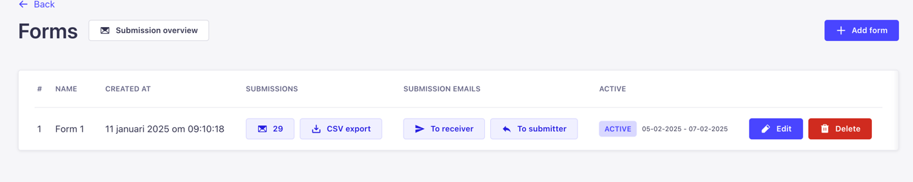
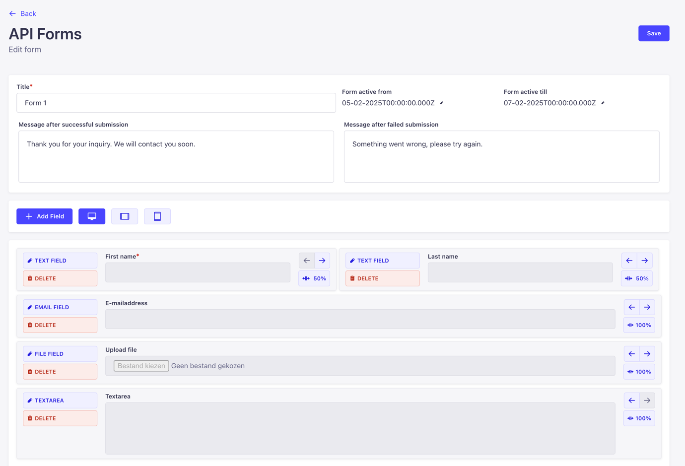
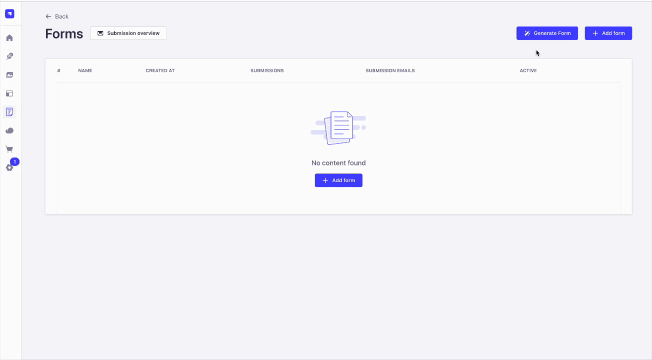

# Strapi v5 Plugin: API-Forms

[](LICENSE)

A Strapi 5 plugin to create dynamic webforms, manage submission handlers and view submissions wrapped in a simple GUI.



**Generating forms with A.I.**


## 🚀 Features

- **Create Dynamic Forms with form builder**
  - Generate form with AI
  - Create forms:
    - Possibility to define a start/end date
    - Add success and error message
    - Create dynamic form fields
      - Supporting multiple screens (phone, tablet, desktop)
      - Supporting multiple field types (text, textarea, checkbox, radio, select and file)
      - Supporting grid (tailwind)
- **Create submission handlers**
  - Currently, manage a custom confirmation and notification after submission
    - Notification for the receiver
    - Confirmation for the submitter
    - WYSIWYG editor with placeholders for the created form fields
    - Test e-mail
- **View and export submissions**

---

## 👏 Support My Work

Hey there! I'm actively maintaining this project on my free time, and if you've found it useful, I'd greatly appreciate
your support. Donations will help cover hosting costs, tools, and allow me to dedicate additional time for updates,
features, and bug fixes.

You can contribute by donating through this link:

[](https://www.paypal.com/donate/?business=DFMEGWFQUZHCQ&no_recurring=0&currency_code=EUR)

I’d be forever grateful for your generosity. Thank you for helping keep this project alive and growing! ❤️

---

## 📦 Installation

To install this plugin, use the **yarn** or **npm** package manager. Run the following command in your Strapi project
directory:

### Yarn:

```bash
yarn add strapi-api-forms-v5
```

### NPM:

```bash
npm install strapi-api-forms-v5
```

---

## 🛠️ Usage

1. **Activate the Plugin**: Once the plugin is installed, Strapi will automatically detect and activate it. You can
   navigate to the Strapi admin panel to find the features of this plugin under `API forms` in the sidebar.

### Example:

To configure the plugin, add the following to your `config/plugins.js` file:

```javascript
module.exports = {
  "api-forms": {
    enabled: true,
    // When using AI functionality
    config: {
      ai: {
        enabled: true,
        apiEndpoint: env('OPEN_AI_API_ENDPOINT', 'https://api.openai.com/v1/chat/completions'),
        apiKey: env('OPEN_AI_SECRET_KEY', ''),
        model: 'gpt-4',
        temperature: 0.3,

      }
    }
  }
};
```

## 🚀 Roadmap

Here are the upcoming features and improvements planned for this project:

- **Multi-Step Form:**  
  Implement a user-friendly multi-step form for better segmentation and organization of complex inputs.

- **Relational Fields with Content Types:**  
  Add support for relational fields that dynamically populate dropdowns (`select` options) or other inputs from linked
  content types.

- **Dependent Fields:**  
  Introduce dependable fields that show or hide based on other field values for improved interactivity and usability.

- **New Field Types:**  
  Add additional field types such as:
  - Date picker
  - Time picker
  - Other necessary custom field types for diverse use cases.

---

**Note:** This is an evolving roadmap, and features may adjust based on user feedback and development priorities. If you
have any suggestions or ideas, feel free to contribute! 😊

## 🤔 FAQ

**Q: What versions of Strapi does this plugin support?**  
A: This plugin supports Strapi v5.x and higher.

**Q: I encountered an issue. How can I get help?**  
A: Please check the "Troubleshooting" section below or open an issue
on [GitHub](https://github.com/your-username/your-plugin-repo/issues).

---

## 📄 License

This plugin is licensed under the MIT License. See the [LICENSE](LICENSE) file for more details.

---

## ❤️ Contributing

We welcome contributions to make this plugin even more awesome! If you'd like to contribute, please follow these steps:

1. Fork the repository.
2. Create a new branch (`git checkout -b feature/new-feature`).
3. Commit your changes (`git commit -m 'Add new feature'`).
4. Push the branch (`git push origin feature/new-feature`).
5. Open a pull request.

---

## 🐛 Troubleshooting

If you encounter issues while using this plugin, here are some troubleshooting steps:

1. Ensure you are using a compatible version of Strapi (e.g., v4.x or later).
2. Check your plugin configuration in `config/plugins.js`.
3. Review logs in the terminal where Strapi is running.

If these steps don't resolve the issue, feel free
to [open an issue on GitHub](https://github.com/your-username/your-plugin-repo/issues).

---

## 📞 Support

If you have questions, issues, or suggestions, feel free to reach out
via [GitHub Issues](https://github.com/your-username/your-plugin-repo/issues).
